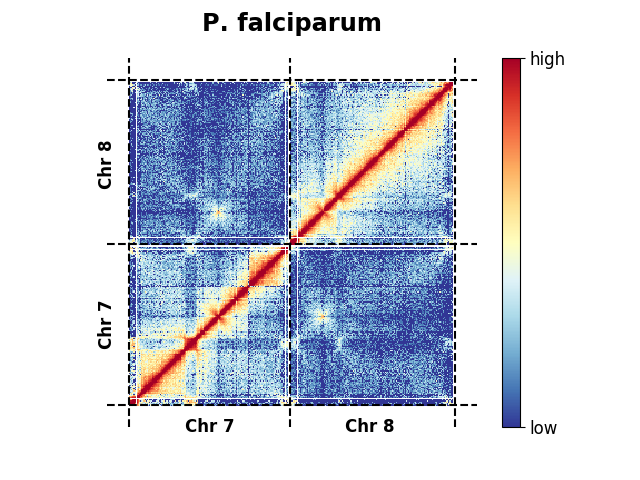

# Summary

The three-dimensional structure of the genome is thought to play an important
role in many biological processes, such as gene regulation and replication.
Recent technological advances allow the measurement, in a single 
experiment, of the frequencies of physical contacts among pairs of genomic
loci at a genome-wide scale. The Hi-C protocol results in a noisy and indirect
measurement of the 3D structure of the genome, yielding a symmetric matrix
where each row and each column correspond to a genomic window, and each entry
to the number of times those windows have been seen interacting with one
another.  As with any genomics experiments, the resulting matrix contains unwanted
variations depending on the GC-content, mappability, and the details of the
protocol used. Before any downstream analysis, this matrix needs to be
appropriately normalized.

[**Iced**](https://github.com/hiclib/iced) implements fast and memory
efficient normalization methods, such the ICE normalization strategy or the
SCN algorithm. It is included in the HiC-pro pipeline, that processes data
from raw fastq files to normalized contact maps [@servant:hicpro]. iced
eventually grew bigger than just being a normalization packages, and contains
a number of utilities functions that may be useful if you are analyzing and
processing Hi-C data.

Moving from sequencing reads to a normalized contact map is a challenging
task. Hi-C usually requires several millions to billions of paired-end
sequencing reads, depending on genome size and on the desired resolution.
Managing these data thus requires optimized bioinformatic workflows able to
extract the contact frequencies in reasonable computational time and with
reasonable resource and storage requirements. The final step of such pipeline
is typically a normalization step, essential to ensure accurate analysis and
proper interpretation of the results.
  
We propose here fast implementations of the iterative correction method
[@imakaev:iterative] and SCN [@cournac:normalization] in Python. iced
emphasizes ease-of-use, performance, maintainability, and memory-efficiency.
This implementation leverages a memory-efficient data format of Hi-C maps, and
outperforms both in speed and memory usage HiCorrector [@li:hi-corrector], a
parallelized C++ implementation of the same algorithm.

# References
